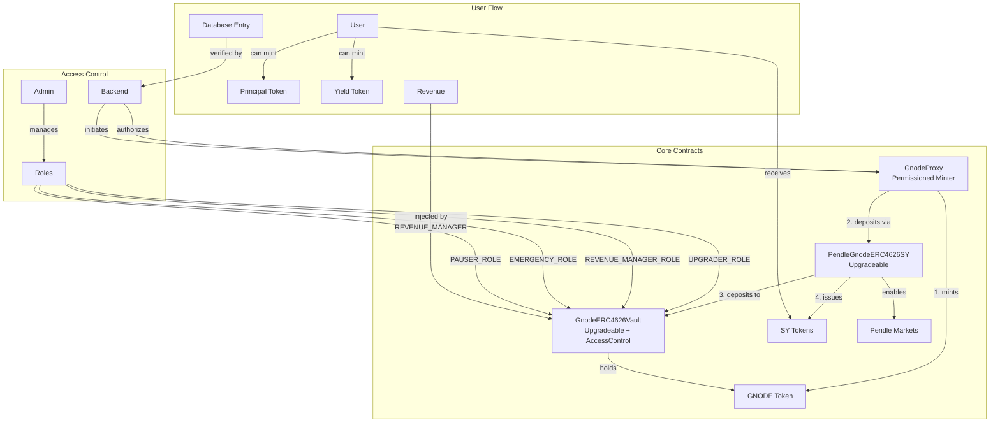

# Gnode Yield Token Integration with Pendle

This implementation provides a yield-bearing, maturity-based Gnode token that integrates with Pendle's PT (Principal Token) and YT (Yield Token) system.

## Architecture Overview



## Contract Components

### 1. GnodeProxy (Permissioned Minter)
- Controls GNODE token minting
- Handles atomic mint-and-deposit through SY
- Verifies backend signatures
- Only way to mint GNODE tokens
- Issues SY tokens directly to users

### 2. GnodeERC4626Vault
- Upgradeable vault implementing ERC4626
- Handles maturity tracking and revenue distribution
- Holds locked GNODE tokens
- Role-based access control

### 3. PendleGnodeERC4626SY
- Upgradeable Standardized Yield wrapper
- Integrates with Pendle's market system
- Enables PT/YT creation
- Entry point for all deposits

## Database to On-Chain Migration Flow

### 1. Proxy Contract Interface

```solidity
interface IGnodeProxy {
    /**
     * @notice Mints GNODE tokens and deposits them through SY contract
     * @param user Address that will receive the SY tokens
     * @param amount Amount of GNODE to mint and deposit
     * @param deadline Timestamp after which the signature expires
     * @param signature Backend signature authorizing the mint
     * @return shares Amount of SY tokens received
     */
    function mintAndDeposit(
        address user,
        uint256 amount,
        uint256 deadline,
        bytes calldata signature
    ) external returns (uint256 shares);

    /**
     * @notice Batch version for gas efficiency
     * @param users Array of addresses that will receive SY tokens
     * @param amounts Array of GNODE amounts to mint and deposit
     * @param deadline Timestamp after which the signature expires
     * @param signature Backend signature authorizing the batch
     * @return shares Array of SY tokens received per user
     */
    function batchMintAndDeposit(
        address[] calldata users,
        uint256[] calldata amounts,
        uint256 deadline,
        bytes calldata signature
    ) external returns (uint256[] memory shares);
}
```

### 2. Migration Process

```javascript
// 1. Backend Flow
const userBalance = await database.getGnodeBalance(userAddress);
const deadline = currentTimestamp + 1 hour;
const message = ethers.utils.solidityKeccak256(
    ["address", "uint256", "uint256"],
    [userAddress, userBalance, deadline]
);
const signature = await backendWallet.signMessage(message);

// 2. Contract Interaction
const tx = await gnodeProxy.mintAndDeposit(
    userAddress,
    userBalance,
    deadline,
    signature
);

// 3. Result
// - GNODE tokens minted to proxy
// - Tokens deposited through SY to vault
// - User receives SY tokens directly
// - Ready for PT/YT minting
```

### 3. Security Measures

```solidity
// In GnodeToken contract
function mint(address to, uint256 amount) external {
    require(msg.sender == gnodeProxy, "Only proxy can mint");
    _mint(to, amount);
}

// In GnodeProxy
function mintAndDeposit(
    address user,
    uint256 amount,
    uint256 deadline,
    bytes calldata signature
) external returns (uint256 shares) {
    // 1. Verify signature
    require(block.timestamp <= deadline, "Signature expired");
    require(
        verifyBackendSignature(user, amount, deadline, signature),
        "Invalid signature"
    );

    // 2. Mint GNODE tokens to this contract
    gnodeToken.mint(address(this), amount);

    // 3. Approve SY contract
    gnodeToken.approve(address(standardizedYield), amount);

    // 4. Deposit through SY contract
    shares = standardizedYield.deposit(
        user,           // receiver
        gnodeToken,     // tokenIn
        amount,         // amount
        0              // minSharesOut (can be calculated off-chain)
    );

    emit MintAndDeposit(user, amount, shares);
}
```

## Complete User Journey

### 1. Database to SY Migration

```javascript
// Starting state:
// - User has 100 GNODE in database
// - No tokens exist yet

// Step 1: Backend authorizes migration
const signature = await getBackendSignature(user, amount);

// Step 2: Execute migration
await gnodeProxy.mintAndDeposit(
    user,
    100e18,        // amount
    deadline,
    signature
);

Result:
- 100 GNODE minted to proxy
- 100 GNODE deposited through SY to vault
- User receives 100 SY tokens
- Ready for PT/YT minting
```

### 2. Creating PT/YT Position (Immediate Next Step)

```javascript
// User can immediately create PT/YT position
await pendleMarket.mintPtAndYt(
    100e18,         // SY amount
    user            // receiver
);

Result:
- 100 PT tokens (principal claim)
- 100 YT tokens (yield claim)
```

[Previous sections about yield distribution, maturity, and revenue injection remain the same...]

## Important Security Notes

1. **Minting Control**
   - Only proxy can mint GNODE tokens
   - Minting always coupled with SY deposit
   - No way to mint without going through Pendle system

2. **Backend Authorization**
   - Signatures expire after deadline
   - Each signature can only be used once
   - Batch operations supported for efficiency

3. **Atomic Operations**
   - Mint and SY deposit are atomic
   - Users never directly hold GNODE
   - Users receive SY tokens directly
   - Failed deposits revert minting

4. **Database Synchronization**
   - Backend should mark entries as migrated
   - Track on-chain status
   - Prevent double migrations

[Rest of the previous content about roles and upgradeability remains the same...]