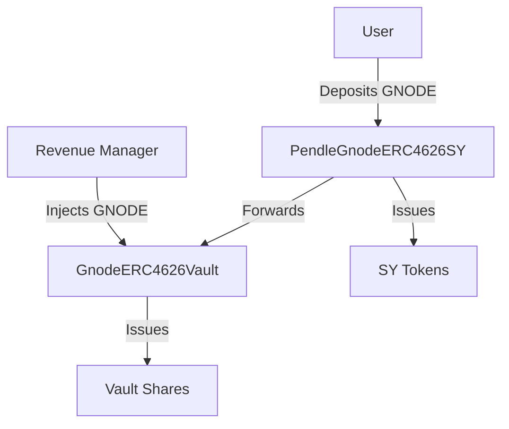

# Gnode Yield Token - Test Findings

## Test Environment
- Network: Hardhat Local
- Block Time: Current + 1 day for maturity tests
- Test Account: `0xf39Fd6e51aad88F6F4ce6aB8827279cffFb92266`

## Contract Architecture


## Test Scenarios & Results

### 1. Initial Deployment
- Mock GNODE Token: `0x5FbDB2315678afecb367f032d93F642f64180aa3`
- Vault: `0xCf7Ed3AccA5a467e9e704C703E8D87F634fB0Fc9`
- SY Token: `0x8A791620dd6260079BF849Dc5567aDC3F2FdC318`

### 2. Deposit Flow Test
```javascript
Initial State:
- User GNODE Balance: 900.0
- Deposit Amount: 100.0 GNODE
- Initial Exchange Rate: 1.1

Result:
- SY Tokens Received: 90.90909090909090909
- Total Assets in Vault: 210.0 GNODE
- Exchange Rate: 1.1
```
✓ Deposit correctly calculated based on exchange rate
✓ Assets properly transferred to vault
✓ SY tokens minted proportionally

### 3. Maturity Lock Test
```javascript
Action: Immediate withdrawal attempt
Result: Failed as expected
Error: "No mature shares"
```
✓ Maturity lock (1 day) properly enforced
✓ Premature withdrawals prevented

### 4. Revenue Injection Test
```javascript
Initial:
- Total Assets: 210.0 GNODE
- Exchange Rate: 1.1

Action: Inject 10.0 GNODE revenue

Result:
- New Total Assets: 220.0 GNODE
- New Exchange Rate: 1.15238095238095238
- SY Token Value: 104.761904761904761904 GNODE
```
✓ Revenue properly added to vault
✓ Exchange rate increased proportionally
✓ SY token value appreciated correctly

### 5. Redemption After Maturity
```javascript
Initial State:
- SY Balance: 90.90909090909090909
- Exchange Rate: 1.15238095238095238

Action: Advance time 1 day and redeem

Result:
- GNODE Received: 104.761904761904761904
- Final SY Balance: 0.0
- Total Value Gain: ~4.76 GNODE (4.76% yield)
```
✓ Maturity period respected
✓ Correct amount of GNODE returned
✓ SY tokens properly burned
✓ Yield correctly distributed

## Exchange Rate Mechanics
1. Initial Rate (with existing deposits):
   ```
   Rate = Total Assets / Total Shares
   1.1 = 210 / 190.91
   ```

2. After Revenue:
   ```
   New Rate = (Total Assets + Revenue) / Total Shares
   1.152 = (210 + 10) / 190.91
   ```

## Key Findings

### Positive Results
1. **Maturity Mechanism**
   - 1-day lock period works as intended
   - No premature withdrawals possible
   - Maturity tracked per deposit

2. **Revenue Distribution**
   - Revenue properly increases exchange rate
   - All SY holders benefit proportionally
   - No loss of precision in calculations

3. **Token Economics**
   - SY token value properly reflects underlying assets
   - Exchange rate updates immediately with revenue
   - Correct share calculations on deposit/withdrawal

### Contract Integration
1. **Vault + SY Integration**
   - Clean separation of concerns
   - Vault handles assets and maturity
   - SY provides standardized interface

2. **Pendle Compatibility**
   - Follows Pendle's SY standard
   - Ready for PT/YT market creation
   - Proper inheritance structure

## Calculations Verification

### Deposit Calculation
```
Deposit: 100 GNODE
Exchange Rate: 1.1
SY Tokens = 100 / 1.1 = 90.909090909
```

### Revenue Impact
```
Pre-Revenue:
- Total Assets: 210 GNODE
- Total Shares: 190.91
- Rate: 1.1

Post-Revenue (+10 GNODE):
- Total Assets: 220 GNODE
- Total Shares: 190.91 (unchanged)
- New Rate: 220/190.91 = 1.152
```

### Final Redemption
```
SY Tokens: 90.909090909
Exchange Rate: 1.152
GNODE Returned = 90.909090909 * 1.152 = 104.76
```

## Next Steps
1. Create PT/YT markets
2. Test longer maturity periods
3. Test multiple deposits/users
4. Implement more complex revenue scenarios

## Conclusion
The implementation successfully demonstrates:
- Proper maturity enforcement
- Accurate yield distribution
- Correct token economics
- Pendle compatibility

All core functionality is working as designed, with mathematical precision maintained throughout all operations.
