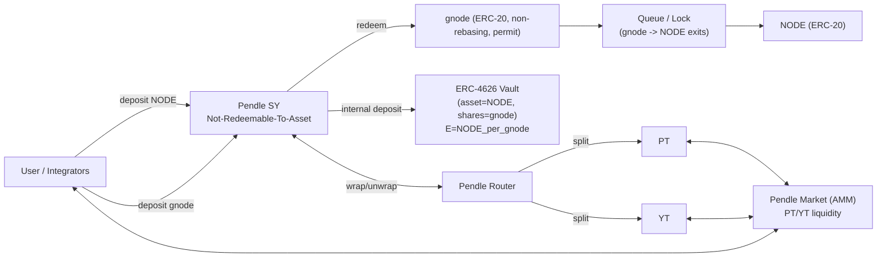
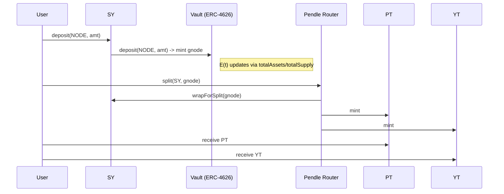
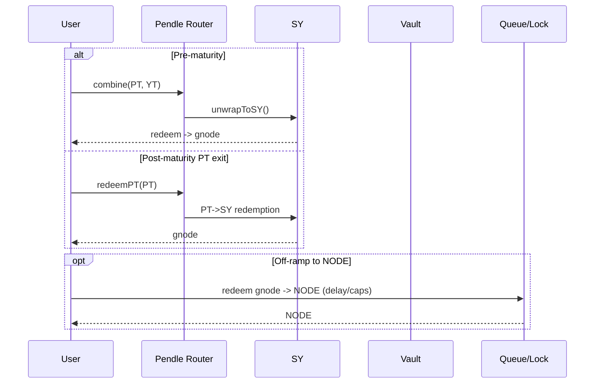
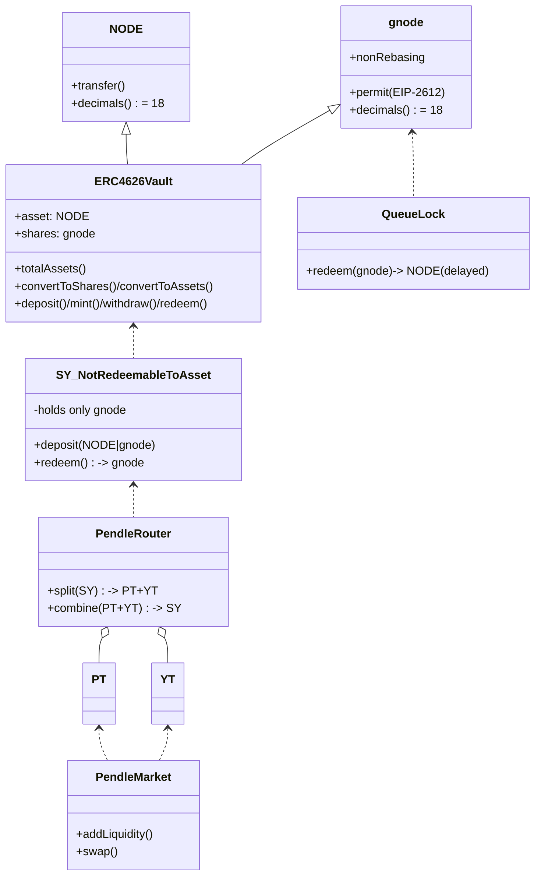

# NODE / gnode × Pendle — End‑to‑End Architecture & User Flow

> **Goal:** A crisp, end‑to‑end, production‑grade map of how our **NODE → gnode (ERC‑4626)** system integrates with **Pendle SY / PT / YT / Markets**, including component responsibilities, on/off‑ramps, user journeys, invariants, and diagrams you can hand to reviewers.

---

## 0) Canonical Terms (single source of truth)
- **Underlying:** `NODE` (ERC‑20, 18d)
- **Vault shares (non‑rebasing):** `gnode` (ERC‑20 + EIP‑2612, 18d)
- **Vault:** `ERC‑4626` with `asset=NODE`, `shares=gnode`, exchange rate
  \[**E(t) = totalAssets / totalSupply = NODE_per_gnode**\]
- **SY (Standardized Yield):** *Not‑Redeemable‑To‑Asset* wrapper over the vault
  - **Deposits:** accepts `NODE` **or** `gnode`
  - **Redeems:** **always** returns `gnode` (never `NODE`)
- **Pendle PT/YT:**
  - **PT (Principal Token):** zero‑coupon claim on `gnode` at maturity
  - **YT (Yield Token):** claim on ΔE(t) yield until maturity
- **Queue/Lock:** off‑ramp that converts `gnode → NODE` subject to delays/caps; SY **never** bypasses this

---

## 1) Big‑Picture Architecture

**Industry sanity check:**
- Vault is the only source of truth for exchange rate; `gnode` is non‑rebasing.
- SY never returns `NODE`; redemptions produce `gnode` only.
- PT/YT minting/burning is routed via Pendle’s Router/Factories; trading happens in the Pendle Market.

---

## 2) Component Responsibilities (RACI‑style)

| Component | Owns | Reads | Writes | Notes |
|---|---|---|---|---|
| **NODE** | External token | n/a | n/a | 18 decimals, fee‑free transfers recommended |
| **gnode** | ERC‑20 (permit) | Vault rate E(t) | Balances | Non‑rebasing shares |
| **ERC‑4626 Vault** | `totalAssets`, `totalSupply`, E(t) | NODE, gnode | mints/burns gnode | Implements preview/rounding (see §6) |
| **SY** | User IO for Pendle | Vault (E(t)) | Holds gnode | Accepts NODE/gnode in; **redeems gnode only** |
| **Pendle Router/Factories** | Mint/burn PT/YT | SY | PT/YT | Uses SY as standardized yield source |
| **Pendle Market** | AMM liquidity & pricing | PT/YT | LP accounting | No business logic about vault |
| **Queue/Lock** | gnode→NODE exits | gnode | NODE | Rate‑limited exits; never called by SY to return NODE |

---

## 3) User Journeys (happy paths)

### A) Passive staker (wants yield, minimal exposure)
1. Deposit **NODE** (or **gnode**) to **SY**.
2. SY internally deposits to **Vault** and holds **gnode** on behalf of the user.
3. User can later redeem **gnode** from SY; to get `NODE`, they go through **Queue**.

### B) PT buyer (principal exposure)
1. Deposit to SY via **Pendle Router** → **Split** to mint **PT + YT**.
2. **Sell YT** on **Market**; **hold PT** until maturity.
3. At maturity, **PT → SY → gnode**.

### C) YT farmer (pure yield exposure)
1. Deposit to SY via Router → **Split** → **Sell PT**, **hold YT**.
2. Accrue yield as **ΔE × notional** until maturity.
3. Optionally **realize** by selling YT or pairing back with PT.

### D) LP (market maker)
1. Provide liquidity to **Pendle Market** (PT/YT pair or per‑market config).
2. Earn fees/incentives; withdraw LP when desired.

---

## 4) Core Mechanics & Math
- **Exchange rate:** `E(t) = totalAssets / totalSupply` (from the vault)
- **YT accrual:** For a position with notional `N_gnode`, yield over \[t0,t1\] is `N_gnode × (E(t1) − E(t0))`.
- **PT payoff:** At maturity T, PT redeems to the gnode principal captured at split time (per Pendle’s design), which you then route **PT → SY → gnode**.
- **No underlying out of SY:** All user‑visible redemptions from SY return `gnode`.

**Negative events:** E(t) may **decrease** (slash/penalty). We **do not clamp**. UIT/Docs must disclose the event and its effect on YT.

---

## 5) Sequence Diagrams

### 5.1 Deposit NODE → SY → Vault → PT/YT split

### 5.2 Redeem pre‑maturity (recombine) or post‑maturity

---

## 6) ERC‑4626 Semantics (rounding & decimals)
- **Decimals:** `NODE` = 18, `gnode` = 18; SY mirrors `gnode` decimals.
- **Rounding (must match code/tests):**
  - `previewDeposit` / `convertToShares`: **floor**
  - `previewMint`    / `convertToAssets`: **ceil**
  - `previewWithdraw`/ `convertToShares`: **ceil**
  - `previewRedeem`  / `convertToAssets`: **floor**
- **S=0 bootstrap:** Define 1:1 for the first deposit; prevent dust that would skew E(0).
- **Donations (optional):** `donate(NODE)` increases `totalAssets` without minting shares.

---

## 7) UML Class Diagram (contracts & relationships)

---

## 8) Invariants & Guardrails (auditor‑friendly)
- **Non‑rebasing shares:** `gnode` balances don’t change from yield; only E(t) moves.
- **No underlying from SY:** SY redemptions return **gnode** only; any attempt to output `NODE` must revert.
- **Immediate vaulting:** Any `NODE` received by SY is immediately deposited into the vault; SY does **not** idle NODE.
- **No fee‑on‑transfer:** NODE should be fee‑free, or the vault must explicitly account for it.
- **Reentrancy:** Vault/SY methods that transfer tokens are `nonReentrant`.

---

## 9) Admin & Upgrade Posture
> Fill addresses before external review.

| Surface | Upgradeable | Admin | Timelock | Pause scope |
|---|---|---|---|---|
| gnode (ERC‑20 + permit) | No | – | – | n/a |
| ERC‑4626 Vault | UUPS (if needed) | Gov multisig | ≥48h | Deposits/withdraws only |
| SY (Not‑Redeemable‑To‑Asset) | Prefer **No** | – | – | n/a |
| Queue/Lock | UUPS (if needed) | Gov multisig | ≥48h | Config params only |

**Change‑management:** publish notice + commit hash for any upgrade; two‑step propose/execute via timelock.

---

## 10) Pendle Listing Plan
1. Deploy **Vault (ERC‑4626)** and **gnode**.
2. Deploy **SY: `PendleERC4626NotRedeemableToAssetSY`** pointing at the vault.
3. Use Pendle factories to mint **PT / YT** for chosen maturities.
4. Deploy **Market**(s), seed initial liquidity, verify `exchangeRate()` ≡ vault E(t).
5. Publish addresses + admin table in docs.

---

## 11) Test Plan (must pass)
- **Vault/SY unit:** rounding matrix @ 1‑wei edges; S=0 bootstrap; `NODE` deposit path; **SY cannot output NODE**; donation behavior.
- **Pendle flows:** split/combine across E(t) changes; ΔE × notional for YT; PT redemption (pre/post maturity); YT transfer mid‑interval snapshotting.
- **Operational:** timelock upgrade dry‑run; pause toggles affect only IO; queue rate‑limit edges.

---

## 12) FAQ for Users
- **Can I get NODE directly from SY?** No. SY outputs `gnode`. Use the **Queue** to off‑ramp `gnode → NODE`.
- **Does my gnode balance grow?** No. It’s non‑rebasing; value grows via the exchange rate E(t).
- **Where does YT yield come from?** From increases in E(t) (`NODE_per_gnode`) realized by the vault.
- **Can E(t) go down?** Yes, in negative events (slash/penalty). We do not clamp.

---

## 13) Consistency Checklist (pre‑review)
- [ ] Only **NODE/gnode** appear in the docs/app (no GNODE/stGnode remnants)
- [ ] SY artifact named exactly as deployed; decimals pinned to 18
- [ ] Rounding rules match tests & code
- [ ] Admin table filled with real addresses & delays
- [ ] Invariants explicitly stated in README/audit scope
